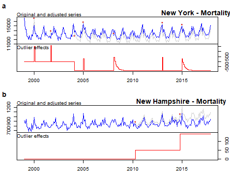

# PAPER TITLE

# Introduction
Here we provide the data and code for:  [**Effects without a Cause: The Search for Demographic Anomalies**](https://github.com/mathewhauer/demographic-anomalies/blob/master/MANUSCRIPT/manuscript.pdf)

### Citation

> Hauer, M.E. & Bohon, S. *Great Journal* (DOI Forthcoming) (YEAR ACCESSED).

# Abstract
> Lorem Ipsum

**Anomaly Detection for New York (a) and New Hampshire (b) state mortality, 1999-2016.** The top part of each panel contains the original time series (light gray), the corrected, counter-factual time series in the absence of anomalies (blue), and the red dots correspond to the onset of detected anomalies. The bottom part of each panel contains the magnitude and type of the outlier in red. In New York (a), we detect additive outliers (AO) in January 2000, September 2001, January 2005, and January 2013; temporary change (TC) outliers in February 2007 and January 2015; and a level shift (LS) starting in February 2004. In New Hampshire (b), we detect two outliers, both level shift outliers (LS) in April 2010 and again in November 2014. These anomalies suggest New York experienced a significant mortality event in September 2001 and New Hampshire experienced approximately 9,700 more deaths than expected since 2010 or 14% more deaths in the state over just seven years.

To see all of the underlying code and the results, [click here](http://htmlpreview.github.io/?https://github.com/mathewhauer/demographic-anomalies/blob/master/MANUSCRIPT/reproduce.html)

# Organization
- `/R/SCRIPTS/`  — Scripts and output for figures included in the main document.
- `/R/DATA-RAW/`  — Initial data resources, unprocessed.
- `/R/DATA-PROCESSED/` — Post-processed data for our analysis.
- `/MANUSCRIPT/manuscript.Rmd` — contains a replication of the manuscript file

- `/MANUSCRIPT/reproduce.Rmd` — contains a replication for underlying estimates.

# Use
- Feel free to create a new branch for further incorporation and analysis. 

# Correspondence
For any issues with the functionality of these scripts please [create an issue](https://github.com/mathewhauer/demographic-anomalies/issues).

## License
The data collected and presented is licensed under the [Creative Commons Attribution 3.0 license](http://creativecommons.org/licenses/by/3.0/us/deed.en_US), and the underlying code used to format, analyze and display that content is licensed under the [MIT license](http://opensource.org/licenses/mit-license.php).